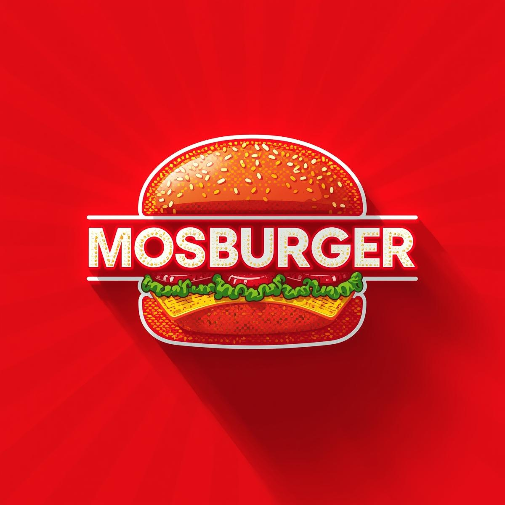

# 🍔 MosBurger Management System

A modern, comprehensive burger shop management system built with HTML5, CSS3, and JavaScript ES6+. Features elegant UI design, real-time inventory management, order processing, and beautiful notifications.



## ✨ Features

### 🏪 **Store Management**
- **Real-time Inventory Tracking**: Monitor stock levels with visual indicators
- **Critical Stock Alerts**: Beautiful slide notifications for low stock items
- **Stock Management**: Add, update, and remove inventory items
- **Category Organization**: Organize items by categories (Burgers, Submarines, Fries, etc.)
- **Price Management**: Set prices and apply discounts
- **Stock Status Indicators**: Visual badges for in-stock, low-stock, and out-of-stock items

### 📋 **Order Management**
- **Customer Selection**: Search and select customers for orders
- **Dynamic Item Search**: Real-time search through menu items
- **Smart Cart System**: Add/remove items with quantity management
- **Stock Validation**: Prevents adding out-of-stock items to cart
- **Order Processing**: Complete order workflow with customer details
- **Order History**: View and manage previous orders
- **Order Status Tracking**: Update order statuses (Pending, Preparing, Ready, Completed)

### 📊 **Dashboard Analytics**
- **Sales Overview**: Daily, weekly, and monthly sales statistics
- **Revenue Tracking**: Real-time revenue monitoring
- **Popular Items**: Best-selling items analysis
- **Order Trends**: Visual charts and graphs
- **Performance Metrics**: Key business indicators

### 🎨 **Modern UI/UX**
- **Glassmorphism Design**: Beautiful glass-like effects with backdrop blur
- **Responsive Layout**: Works perfectly on desktop and mobile devices
- **Smooth Animations**: Elegant transitions and hover effects
- **Dark Theme**: Modern dark color scheme with accent colors
- **Interactive Elements**: Engaging user interactions throughout

### 🔔 **Smart Notifications**
- **Slide Notifications**: Elegant slide-in notifications from the right
- **Multiple Types**: Success, error, warning, and info notifications
- **Auto-dismiss**: Automatic dismissal with progress indicators
- **Manual Close**: Click to dismiss notifications instantly
- **Stock Alerts**: Beautiful notifications for inventory issues

## 🚀 Quick Start

### Prerequisites
- Modern web browser (Chrome, Firefox, Safari, Edge)
- Local web server (built-in Python server recommended)

### Installation

1. **Clone the repository**
   ```bash
   git clone https://github.com/Sanjaya-Samudra/My-Burger-Shop.git
   cd My-Burger-Shop/MosBurger
   ```

2. **Start the local server**
   ```bash
   # Using Python (recommended)
   python -m http.server 8000

   # Or using Node.js
   npx http-server -p 8000

   # Or using PHP
   php -S localhost:8000
   ```

3. **Open in browser**
   ```
   http://localhost:8000/
   ```

## 📁 Project Structure

```
MosBurger/
├── index.html                 # Main dashboard page
├── store-management.html      # Inventory management interface
├── order-management.html      # Order processing system
├── reports.html              # Analytics and reporting
├── signup.html               # User registration
├── styles.css                # Main stylesheet with modern design
├── js/
│   ├── dashboard.js          # Dashboard analytics and charts
│   ├── store-management.js   # Inventory management logic
│   ├── order-management.js   # Order processing functionality
│   ├── login.js              # Authentication handling
│   ├── reports.js            # Report generation
│   └── signup.js             # Registration form handling
└── README.md                 # This file
```

## 🎯 Key Features Showcase

### **Smart Inventory Management**
- **Visual Stock Indicators**: Color-coded badges show stock status
- **Critical Alerts**: Slide notifications for items running low
- **Stock Validation**: Prevents overselling and maintains accuracy

### **Elegant Order Processing**
- **Customer Search**: Fuzzy search through customer database
- **Item Filtering**: Category-based and search-based item filtering
- **Cart Management**: Real-time cart updates with stock validation
- **Order Completion**: Seamless order processing workflow

### **Beautiful Notifications**
- **Slide Animations**: Smooth slide-in from right side
- **Progress Bars**: Visual countdown for auto-dismissal
- **Type-Specific Styling**: Different colors and icons for each type
- **Glassmorphism Effects**: Modern translucent design

### **Responsive Design**
- **Mobile-First**: Optimized for all screen sizes
- **Touch-Friendly**: Large touch targets for mobile devices
- **Adaptive Layout**: Content adjusts to screen width

## 🛠️ Technical Stack

- **Frontend**: HTML5, CSS3, JavaScript ES6+
- **Styling**: Custom CSS with glassmorphism effects
- **Icons**: Font Awesome 6
- **Charts**: Chart.js for data visualization
- **Storage**: LocalStorage for data persistence
- **Architecture**: Modular JavaScript with separation of concerns

## 📊 Data Management

The system uses LocalStorage for data persistence with the following data structures:

- **Food Items**: Inventory with categories, prices, stock levels
- **Customers**: Customer database with contact information
- **Orders**: Complete order history with timestamps and status
- **Settings**: User preferences and system configuration

## 🎨 Design System

### Color Palette
- **Primary**: `#FF6B35` (Orange)
- **Secondary**: `#2D3748` (Dark Gray)
- **Success**: `#10B981` (Green)
- **Error**: `#EF4444` (Red)
- **Warning**: `#F59E0B` (Yellow)
- **Background**: `#1A202C` (Dark Blue-Gray)

### Typography
- **Primary Font**: System font stack for optimal performance
- **Headings**: Bold, modern typography
- **Body Text**: Clean, readable text

### Components
- **Cards**: Glassmorphism effect with subtle shadows
- **Buttons**: Gradient backgrounds with hover animations
- **Forms**: Modern input styling with focus states
- **Notifications**: Slide-in panels with progress indicators

## 🔧 Development

### Adding New Features
1. Follow the modular structure in `/js/` directory
2. Use consistent naming conventions
3. Implement proper error handling
4. Add appropriate user feedback

### Code Style
- **JavaScript**: ES6+ with modern syntax
- **CSS**: BEM methodology with custom properties
- **HTML**: Semantic markup with accessibility considerations

### Testing
- Test all features across different browsers
- Verify responsive behavior on various screen sizes
- Ensure data persistence works correctly

## 📈 Performance

- **Fast Loading**: Optimized assets and minimal dependencies
- **Smooth Animations**: Hardware-accelerated CSS animations
- **Efficient Rendering**: Virtual scrolling for large lists
- **Memory Management**: Proper cleanup of event listeners

## 🤝 Contributing

1. Fork the repository
2. Create a feature branch (`git checkout -b feature/amazing-feature`)
3. Commit your changes (`git commit -m 'Add amazing feature'`)
4. Push to the branch (`git push origin feature/amazing-feature`)
5. Open a Pull Request

## 📄 License

This project is licensed under the MIT License - see the [LICENSE](LICENSE) file for details.

## 🙏 Acknowledgments

- **Icons**: Font Awesome for beautiful icons
- **Charts**: Chart.js for data visualization
- **Inspiration**: Modern web design trends and UX best practices

## 📞 Support

For support, please open an issue on GitHub or contact the development team.

---

**Built with ❤️ for modern burger shop management**